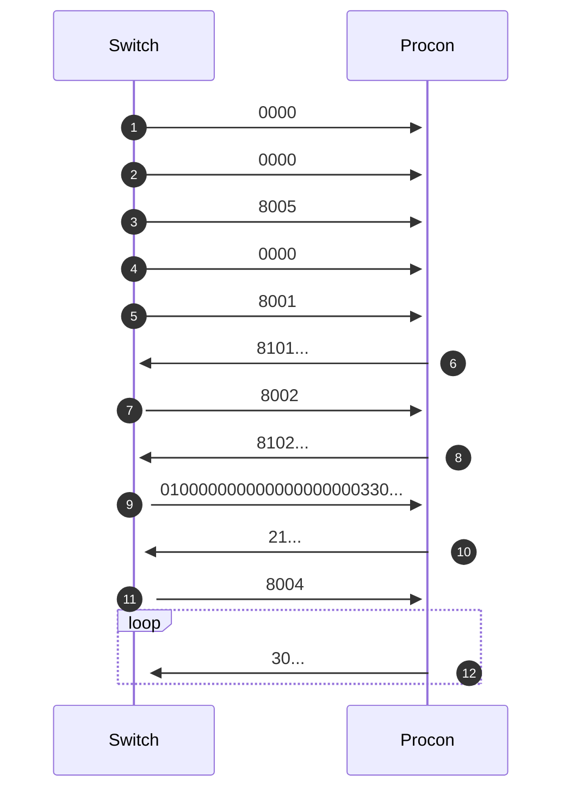

# SwitchConnectionManager
* Switchとプロコンの接続プロトコルをシュミレートし、プロセスを落とさずに再接続ができるようになる
* 今までだと、Switchかコントローラとの接続がどちらか切れた時点でプロセスを終了していましたが、これを使うことで以下のことができるようになります
  * Switchとの接続が切れたら、プロセスを維持したまま物理コントローラからの入力を受け取り続けて、Switchと仮想コントローラで新しく接続を行い、接続ができたら物理コントローラと繋ぐ
  * 物理コントローラとの接続が切れたら、物理コントローラと仮想Switchで接続を行い、接続できたら物理Switchと物理コントローラを繋ぐ

## Installation

Add this line to your application's Gemfile:

```ruby
gem 'switch_connection_manager'
```

And then execute:

    $ bundle install

## Usage

TODO: Write usage instructions here


## 接続プロトコル(プロコンがデータを送信するようになるまで)




## License

The gem is available as open source under the terms of the [MIT License](https://opensource.org/licenses/MIT).

## TODO:
* PBMとプロコンをbluetoothで接続する
* usb gadgetをresetしてからすぐにavailableになる時と、数秒開けないとavailableにならない時がある.
  * readとかすれば状態を認知できて適切なインターバルがわかるかも
  * resetしてからインターバルが長すぎると接続できない？
* プロコン, Switchのそれぞれと接続するクラスを作る
  - [ ] これらができたら繋げてバイパスをする
  - [ ] procon, switch_simulatorを動かしてどこまで作ったのかを思い出す
  - [ ] proconを動かす場合は、未接続の時にちゃんとジャイロを送信することを動作確認をすること
